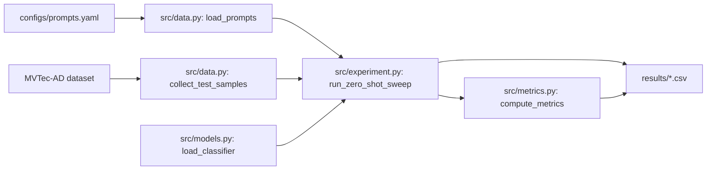

# MVTec-VLM-Robustness

A reproducible study of vision-language model performance for industrial defect classification on MVTec-AD, evaluated under realistic image corruptions that reflect factory-floor deployment conditions.

## Motivation

Vision-language models (CLIP, SigLIP) have shown strong zero-shot and few-shot performance on clean benchmark images, but industrial deployment involves lighting variation, motion blur, sensor noise, compression artifacts, and partial occlusion. This project asks: which VLMs actually hold up under those conditions, and does few-shot fine-tuning improve robustness or just clean-image accuracy?

## Current status

- ✅ Zero-shot baseline complete (CLIP + SigLIP, 15 categories, 3 prompt strategies)
- 🚧 Few-shot LoRA fine-tuning in progress
- 🚧 Corruption robustness evaluation planned

## Zero-shot results

Mean over 15 MVTec-AD categories, per (model, prompt strategy):

| Model  | Strategy           | Balanced Accuracy | AUROC |
| ------ | ------------------ | ----------------- | ----- |
| CLIP   | naive              | 0.587             | 0.710 |
| CLIP   | visual_primitive   | 0.554             | 0.696 |
| CLIP   | category_specific  | 0.583             | 0.771 |
| SigLIP | naive              | **0.638**         | **0.816** |
| SigLIP | visual_primitive   | 0.577             | 0.723 |
| SigLIP | category_specific  | 0.534             | 0.775 |

Key findings:
- Zero-shot VLMs are weak on industrial defect classification (best mean bal_acc 0.638).
- Naive prompts outperform both visual-primitive and category-specific prompt engineering on both models.
- SigLIP consistently outperforms CLIP by 5–8 points across metrics.

Full per-category results in `results/zero_shot_results.csv`.

## Pipeline



## Reproduction

### Setup

```bash
git clone https://github.com/aakashvanmali45/mvtec-vlm-robustness.git
cd mvtec-vlm-robustness
python -m venv venv
source venv/bin/activate      # Windows: venv\Scripts\activate
pip install -r requirements.txt
```

### Run the zero-shot sweep

Requires the MVTec-AD dataset (download from [mvtec.com](https://www.mvtec.com/company/research/datasets/mvtec-ad)).

```bash
python scripts/run_zero_shot.py \
    --config configs/zero_shot.yaml \
    --data-root /path/to/mvtec-ad
```

For a quick smoke test on one category:

```bash
python scripts/run_zero_shot.py \
    --config configs/zero_shot.yaml \
    --data-root /path/to/mvtec-ad \
    --categories bottle
```

### Run on Kaggle

The full sweep takes 15–20 minutes on a Kaggle T4:

```python
!git clone https://github.com/aakashvanmali45/mvtec-vlm-robustness.git
%cd mvtec-vlm-robustness
!pip install -q pyyaml
!python scripts/run_zero_shot.py \
    --config configs/zero_shot.yaml \
    --data-root /kaggle/input/datasets/ipythonx/mvtec-ad
```

